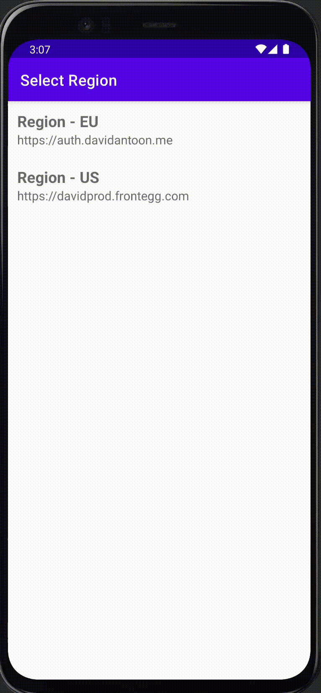

# Advanced options

In this guide, you'll find an overview and best practices for enabling advanced features like passkeys and multi-app configurations.

## Sentry logging (trace IDs + error tracking)

When `FRONTEGG_ENABLE_SENTRY_LOGGING` is enabled, the SDK will:

- Add **Sentry breadcrumbs** for HTTP requests and received `frontegg-trace-id` headers (helps correlating client issues with server logs)
- Save recent trace IDs to a local file `frontegg-trace-ids.log` in the app's internal storage (`filesDir`)

### Enable Sentry logging

Add these `buildConfigField`s to your app module (or set them via `frontegg.properties` in this repo):

```groovy
buildConfigField "boolean", "FRONTEGG_ENABLE_SENTRY_LOGGING", "true"
buildConfigField "int", "FRONTEGG_SENTRY_MAX_QUEUE_SIZE", "30"
```

Notes:

- `FRONTEGG_SENTRY_MAX_QUEUE_SIZE` maps to Sentry's `maxCacheItems` (offline queue size).
- DSN is configured inside the SDK and should match the iOS Swift SDK setup.

## Passkeys authentication

Passkeys enable seamless, passwordless login with biometric authentication and WebAuthn. Follow these steps to integrate them manually using Frontegg's APIs.

**Prerequisites**

```kotlin
dependencies {
    implementation("androidx.browser:browser:1.8.0")
}
```

**Register Passkey:**

```kotlin
requireContext().fronteggAuth.registerPasskeys(activity!!) { error ->
    if (error != null) {
        Log.e("FronteggAuth", "Failed to register passkey: $error")
    } else {
        Log.i("FronteggAuth", "Passkey registered successfully")
    }
}
```

**Login with passkey:**

```kotlin
requireContext().fronteggAuth.loginWithPasskeys(activity!!) { error ->
    if (error != null) {
        Log.e("FronteggAuth", "Failed to login with passkey: $error")
    } else {
        Log.i("FronteggAuth", "Logged in successfully with passkey")
    }
}
```


## Multi-apps support

This guide outlines the steps to configure your Android application to support multiple applications.

### Modify the `Build.gradle` file

Add `FRONTEGG_APPLICATION_ID` buildConfigField into the `build.gradle` file:

Groovy:

```groovy
def fronteggApplicationId = "{{FRONTEGG_APPLICATION_ID}}"
...
android {
    ...
    buildConfigField "String", 'FRONTEGG_APPLICATION_ID', "\"$fronteggApplicationId\""
}
```

Kotlin:

```kotlin
val fronteggApplicationId = "{{FRONTEGG_APPLICATION_ID}}"
...
android {
    ...
    buildConfigField("String", "FRONTEGG_APPLICATION_ID", "\"$fronteggApplicationId\"")
}
```

## Step-up authentication

Step-up authentication is a security feature that temporarily elevates a user's authentication level to perform sensitive actions, such as accessing personal data, making transactions, or changing security settings.

This guide describes how to use the `isSteppedUp` and `stepUp` methods in your Android application to ensure that your app handles sensitive actions securely by checking authentication status and prompting for re-verification only when necessary.

Please follow [this guide](https://developers.frontegg.com/guides/step-up/intro) for more details.

**stepUp**:

Triggers the step-up authentication process. Typically involves MFA or other user verification.

```
requireContext().fronteggAuth.stepUp(
    activity = this,
    maxAge = Duration.ofMinutes(5)
) { error ->
    if (error != null) {
// Handle authentication failure
        Log.e("StepUp", "Authentication failed", error)
    } else {
// Authentication succeeded, continue with sensitive action
        performSecureOperation()
    }
}
```

`activity`: The current Android Activity instance.

`callback`: A callback that receives an Exception if something goes wrong.

`maxAge` (optional): Same as in isSteppedUp, defines how long the step-up remains valid.

**isSteppedUp**:

This method whether the user has already completed a step-up authentication and is allowed to proceed.

```
val isSteppedUp = requireContext().fronteggAuth.isSteppedUp(maxAge = Duration.ofMinutes(5))

if (isSteppedUp) {
// Proceed with sensitive operation
} else {
// Trigger step-up
}
```

**Example**:

```
fun onSecureActionClicked() {
  if (requireContext().fronteggAuth.isSteppedUp(maxAge = Duration.ofMinutes(5))) {
    performSecureOperation()
  } else {
    requireContext().fronteggAuth.stepUp(this, Duration.ofMinutes(5)) { error ->
      if (error == null) {
        performSecureOperation()
      } else {
        Toast.makeText(this, "Step-up failed: ${error.message}", Toast.LENGTH_LONG).show()
      }
    }
  }
}

fun performSecureOperation() {
// Execute the action that requires elevated authentication
}
```


## Multi-region support

This guide outlines the steps to configure your Android application to support multiple regions.

#### Modify the Build.gradle file

First, remove `buildConfigFields` from your `build.gradle` file:

Groovy:

```groovy

android {
    //  remove these lines:
    //  buildConfigField "String", 'FRONTEGG_DOMAIN', "\"$fronteggDomain\""
    //  buildConfigField "String", 'FRONTEGG_CLIENT_ID', "\"$fronteggClientId\""
}
```

Kotlin:

```kotlin

android {
    //  remove these lines:
    //  buildConfigField("String", "FRONTEGG_DOMAIN", "\"$fronteggDomain\"")
    //  buildConfigField("String", "FRONTEGG_CLIENT_ID", "\"$fronteggClientId\"")
}
```


#### Modify the app file

First, adjust your `App.kt/java` file to handle multiple regions:

**Modifications**:

- **Remove** the existing `FronteggApp.init` function.
- **Add** Call `FronteggApp.initWithRegions` with array of `regions`. This array will hold dictionaries for each region.

Example `App.kt` code:

```kotlin

class App : Application() {

    companion object {
        lateinit var instance: App
    }

    override fun onCreate() {
        super.onCreate()
        instance = this

        FronteggApp.initWithRegions(
            listOf(
                RegionConfig(
                    "eu",
                    "autheu.davidantoon.me",
                    "b6adfe4c-d695-4c04-b95f-3ec9fd0c6cca"
                ),
                RegionConfig(
                    "us",
                    "authus.frontegg.com",
                    "6903cab0-9809-4a2e-97dd-b8c0f966c813"
                )
            ),
            this
        )
    }
}
```

#### Add AssetLinks for each region

For each region, configuring your Android `AssetLinks`. This is vital for proper API routing and
authentication.

#### Add Intent-Filter in Manifest.xml

The first domain will be placed automatically in the `AndroidManifest.xml` file. For each additional
region, you will need to add an `intent-filter`. Replace `${FRONTEGG_DOMAIN_2}` with the second domain address.

**NOTE**: if you are using `Custom Chrome Tab` you need to use `android:name` `com.frontegg.android.HostedAuthActivity` instead of `com.frontegg.android.EmbeddedAuthActivity`.

```xml

<application>
  <activity android:exported="true" android:name="com.frontegg.android.EmbeddedAuthActivity"
          tools:node="merge">
    <!-- DONT NOT COMBINE THE FOLLOWING INTENT-FILTER INTO ONE-->
    <intent-filter android:autoVerify="true">
      <action android:name="android.intent.action.VIEW" />
      <category android:name="android.intent.category.DEFAULT" />
      <category android:name="android.intent.category.BROWSABLE" />

      <data android:scheme="https" />
      <data android:scheme="http" />
      <data android:host="${FRONTEGG_DOMAIN_2}" />
      <data android:pathPrefix="/oauth/account/activate" />
    </intent-filter>
    <intent-filter android:autoVerify="true">
      <action android:name="android.intent.action.VIEW" />
      <category android:name="android.intent.category.DEFAULT" />
      <category android:name="android.intent.category.BROWSABLE" />

      <data android:scheme="https" />
      <data android:scheme="http" />
      <data android:host="${FRONTEGG_DOMAIN_2}" />
      <data android:pathPrefix="/oauth/account/invitation/accept" />
    </intent-filter>
    <intent-filter android:autoVerify="true">
      <action android:name="android.intent.action.VIEW" />
      <category android:name="android.intent.category.DEFAULT" />
      <category android:name="android.intent.category.BROWSABLE" />

      <data android:scheme="https" />
      <data android:scheme="http" />
      <data android:host="${FRONTEGG_DOMAIN_2}" />
      <data android:pathPrefix="/oauth/account/reset-password" />
    </intent-filter>
    <intent-filter android:autoVerify="true">
      <action android:name="android.intent.action.VIEW" />
      <category android:name="android.intent.category.DEFAULT" />
      <category android:name="android.intent.category.BROWSABLE" />

      <data android:scheme="https" />
      <data android:scheme="http" />
      <data android:host="${FRONTEGG_DOMAIN_2}" />
      <data android:pathPrefix="/oauth/account/login/magic-link" />
    </intent-filter>
  </activity>

  <activity android:exported="true" android:name="com.frontegg.android.AuthenticationActivity"
          tools:node="merge">

    <!-- DONT NOT COMBINE THE FOLLOWING INTENT-FILTER INTO ONE-->
    <intent-filter android:autoVerify="true">
      <action android:name="android.intent.action.VIEW" />
      <category android:name="android.intent.category.DEFAULT" />
      <category android:name="android.intent.category.BROWSABLE" />

      <data android:scheme="https" />
      <data android:scheme="http" />
      <data android:host="${FRONTEGG_DOMAIN_2}" />
      <data android:pathPrefix="/oauth/account/redirect/android/${package_name}" />
    </intent-filter>
    <intent-filter>
      <action android:name="android.intent.action.VIEW" />
      <category android:name="android.intent.category.DEFAULT" />
      <category android:name="android.intent.category.BROWSABLE" />
      
      <data android:host="${FRONTEGG_DOMAIN_2}" android:scheme="${package_name}" />
    </intent-filter>
  </activity>
</application>
```

### Implement region selection UI

The final step is to implement a UI for the user to select their region. **This can be done in any
way you see fit**.
The example application uses a simple picker view to allow the user to select their region.

**Important considerations**

- **Switching regions**: To switch regions, update the selection in Shared Preferences. If issues
  arise, a **re-installation** of the application might be necessary.
- **Data isolation**: Ensure data handling and APIs are region-specific to prevent data leakage
  between regions.

|                    Select EU Region                    |                    Select US Region                    |
|:------------------------------------------------------:|:------------------------------------------------------:|
|  |  |


```kotlin
package com.frontegg.demo

import androidx.appcompat.app.AppCompatActivity
import android.os.Bundle
import android.widget.LinearLayout
import com.frontegg.android.FronteggApp

class RegionSelectionActivity : AppCompatActivity() {
    override fun onCreate(savedInstanceState: Bundle?) {
        super.onCreate(savedInstanceState)
        setContentView(R.layout.activity_region_selection)
    }


    override fun onResume() {
        super.onResume()

        val euButton = findViewById<LinearLayout>(R.id.euButton)
        val usButton = findViewById<LinearLayout>(R.id.usButton)

        euButton.setOnClickListener {
            requireContext().fronteggAuth.initWithRegion("eu")
            finish()
        }

        usButton.setOnClickListener {
            requireContext().fronteggAuth.initWithRegion("us")
            finish()
        }
    }
}
```